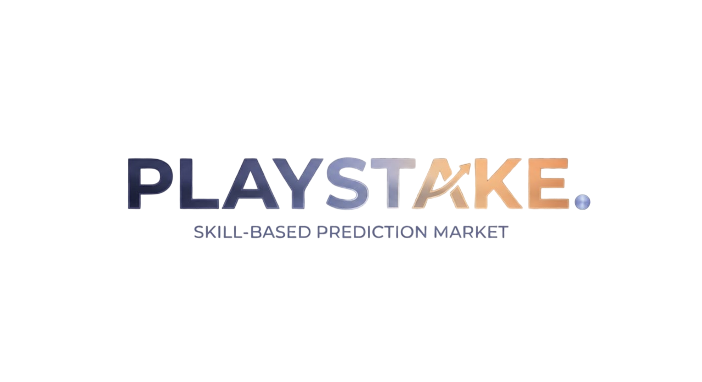

<div align="center">
  
  <h1>PlayStake</h1>
  <p><b>Skill-based prediction markets for GameFi on OneChain.</b></p>

  [](https://onelabs.cc)
  [](https://react.dev/)
  [](https://sui.io/)
</div>

---

## 🎮 What is PlayStake?
PlayStake is a fully decentralized, non-custodial prediction market where players stake on their own in-game performance before a match. Spectators can also back top players. 

After a match finishes, the **OnePlay Oracle** posts verified game statistics on-chain, and the smart contracts automatically settle all bets. Zero admin keys, zero house edge.

---

## ⚡ Features
- **Real-time On-Chain Settlement**: Market resolutions trigger immediate native SUI payouts.
- **Player Profiles**: Mint an on-chain NFT profile to track XP, win-rate, and rank progression.
- **Live Leaderboards**: View real-time verified match statistics securely pulled from the OneChain network.
- **Autonomous AI Liquidity**: A built-in Node bot that automatically seeds markets with initial liquidity based on predictive modeling.

---

## 🏗️ Architecture

| Component | Tech Stack | Description |
| :--- | :--- | :--- |
| **Smart Contracts** | Move (Sui-compatible) | Handles escrow (SUI Coin balances), bet placement, oracle verification, and secure payouts. |
| **Frontend UI** | React 19, Vite, Tailwind | Premium gaming dashboard with glassmorphism, dynamic progress bars, and animations. |
| **Oracle Relay** | Node.js, WebSockets | Listens to live game servers (PUBG, Valorant) and submits finalized stats to the blockchain. |
| **AI Agent** | Node.js, TypeScript | Automatically creates markets and places predictive bets every 5 minutes to maintain liquidity. |

---

## 🚀 Quick Start

### 1. Prerequisites
- [Node.js](https://nodejs.org/) v18+
- [Sui CLI](https://docs.sui.io/guides/developer/getting-started/sui-install) (configured for OneChain Testnet)

### 2. Smart Contracts Deploy
```bash
# Navigate to contracts directory
cd contracts

# Build and deploy Move packages
sui move build
sui client publish --gas-budget 100000000
```
*Note: After deployment, copy the `PACKAGE_ID` and `ORACLE_CAP_ID` into your `.env` files.*

### 3. Run the Infrastructure
Start the frontend and the oracle relay agent locally.

**Terminal 1 (AI Agent & Oracle Relay):**
```bash
cd oracle-relay
npm install
npm run dev
```

**Terminal 2 (Frontend React App):**
```bash
cd frontend
npm install
npm run dev
```
Visit http://localhost:5173 to access the DApp.

---

## 🧪 Testing

The contracts include an extensive suite of pure unit tests. E2E tests verify the complete flow using real RPC nodes and native coin splitting.

```bash
# Run Move Unit Tests
cd contracts && sui move test

# Run End-To-End (E2E) Test Suite
npx tsx e2e/full_flow_test.ts
```

---

## 🎨 UI/UX Design System
PlayStake uses a custom design system tailored for modern gaming aesthetics.
- **Colors**: Deep Voids (`#050508`), Accent Lavender (`#B7BDF7`), Neon Gold (`#F6B17A`).
- **Typography**: `Orbitron` (Display), `Rajdhani` (Tech stats), `JetBrains Mono` (Data points).
- **Animations**: Subtle float mechanics, mouse-reactive gradients, and pulse-glow indicators for live data segments.

---

<div align="center">
  <i>Built for the OneHack 3.0 Hackathon on OneChain.</i>
</div>
