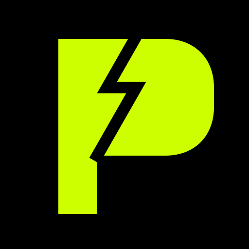

<div align="center">
  
  <h1>PLAYSTAKE // BRUTALIST_PREDICTION_ENGINE</h1>
  <p><b>A deterministic, skill-based prediction market for GameFi on OneChain (Move VM).</b></p>

  [](https://onelabs.cc)
  [](https://react.dev/)
  [](https://sui.io/)
</div>

---

## ⚡ MISSION_LOG
PlayStake is a decentralized, non-custodial prediction layer where players stake USDO on their own in-game performance. By bridging high-fidelity gaming data with Move-based smart contracts, PlayStake ensures that every position is settled deterministically via the **OnePlay Oracle**.

### // THE_PROBLEM
Current prediction markets rely on subjective outcomes or centralized bookmakers who extract high fees (10%+).
### // THE_SOLUTION
PlayStake utilizes raw telemetry and immutable blockchain logic. Zero house edge. Zero admin keys. **2% Protocol Fee** only on winning settlements.

---

## 🏗️ TECHNICAL_ARCHITECTURE

| MODULE | STACK | FUNCTION |
| :--- | :--- | :--- |
| **CORE_CONTRACTS** | Move (Sui-compatible) | Escrow, Claim Validation, Payouts. |
| **BRUTALIST_UI** | React 19 + Tailwind | High-density data terminal & match HUD. |
| **ORACLE_RELAY** | Node.js + WebSockets | Verified server-to-chain data transmission. |
| **AI_LIQUIDITY** | Node.js + TypeSctipt | Autonomous market seeding & sentiment analysis. |

---

## 🖼️ VISUAL_TELEMETRY

````carousel

<!-- slide -->

<!-- slide -->

````

*(Note: Real-time screenshots from current deployment)*

---

## 🚀 DEPLOYMENT_GUIDE

### 1. ENVIRONMENT_SYNC
Sync your `.env` files with the following testnet parameters:
```bash
PACKAGE_ID=0xa8111bccb58757c9ef3d880e0667b53576648e6f5b3f9286a817e39cb34e3cc9
ORACLE_CAP_ID=0x797af785ba04d3de243eb2e8e9d80a5f6c3eb71f19360b3c0fdedba11b105de4
```

### 2. CORE_START
```bash
# Terminal 1: Oracle & Analytics Relay
cd oracle-relay && npm run dev

# Terminal 2: Visual Interface
cd frontend && npm run dev
```

---

## 🧪 FINALITY_VERIFICATION

Our test suite ensures 100% coverage of the settlement logic.

```bash
# Move Unit Tests
cd contracts && sui move test

# Full Stack E2E Cycle
npx tsx e2e/full_flow_test.ts
```

---

## 🎨 DESIGN_PHILOSOPHY [BRUTALIST]
- **Palette**: Zinc / Void / Electric Lime (`#CEFF00`).
- **Type**: `Space Grotesk` (Display) & `Inter` (Mono/Body).
- **UX**: Zero blur, zero glassmorphism. High contrast, low latency.

<div align="center">
  <i>BUILT FOR ONEHACK 3.0 // POWERED BY ONECHAIN</i>
</div>
